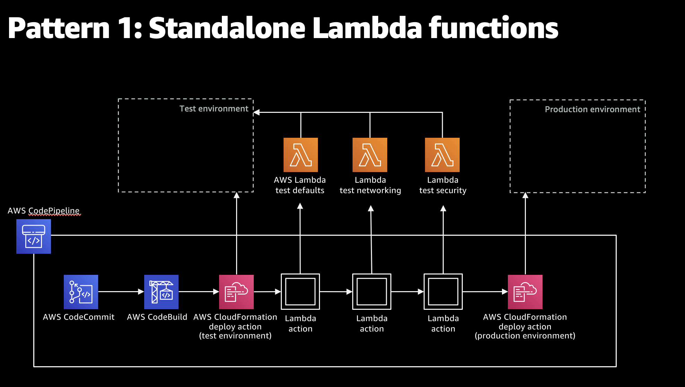

# re:Invent 2020 DOP301 - Testable Infrastructure

Reliable integration testing gives developers the confidence needed to promote the changes from testing to production environments. But how should you think about implementing tests for your applications? In this session, learn integration testing best practices with AWS CodePipeline, AWS CodeBuild, and AWS Step Functions.

View the recording of the session including the live demo on YouTube: 
https://www.youtube.com/watch?v=KJC380Juo2w

Deploying infrastructure as code makes it easier to quickly and repeatably deploy resources. It also makes it easier to programmatically test those resources before propagating them to higher environments. Adding integration tests to your infrastructure deployment has several advantages in comparison to unit testing:
- Tests deployed resources as a group
- Exposes potential problems between deployments
- Exposes cascading failures
- Exposes potential security gaps in deployed systems
- Tests against a production-like environment

On-premises, we tend to stay in our functional silos of infrastructure, application, and security responsibilities. On AWS, we can build and test each of these domains together.

On-premises, environments can get stale or be inconsistent as they are managed separately. On AWS, we can provision infrastructure as code and deploy multiple copies of the same resources and easily keep them up to date.

On-premises, we have simplified test environments because it's expensive to provision production-like hardware for testing purposes. On AWS, you can easily spin up a duplicate environment that looks just like production, and spin it back down when we no longer need it. 

The session walks through 3 patterns:

## Pattern 1: Standalone Lambda Functions
(created manually or via a separate deployment)




## Pattern 2: Integrated Lambda functions 
(created by and invoked by the same pipeline as your infrastructure)


## Pattern 3: StepFunctions 


## Deploy
Prerequisites:
- Install git and configure git access in your AWS account
- Clone repo locally using git
- Set up .aws/credentials profile
- Install npm and the AWS CDK
- Bootstrap the CDK

```bash
`cd pattern2`
`npx run build`   compile typescript to js
`cdk synth`       emits the synthesized CloudFormation template
`cdk deploy Pattern2Stack`      deploy the Pattern2 stack to your default AWS account/region

`git init && git branch -m main && git add . && git commit -m "Initial commit" && git remote rm origin`
`git remote add origin https://git-codecommit.<REGION>.amazonaws.com/v1/repos/pattern2-repo`
`git config main.remove origin && git config main.merge refs/heads/main && git push --set-upstream origin main`
```

To deploy the Pattern3 stack:

```bash
`cd pattern3`
`npx run build`   compile typescript to js
`cdk synth`       emits the synthesized CloudFormation template
`cdk deploy Pattern3Stack`      deploy the Pattern3 stack to your default AWS account/region

`git init && git branch -m main && git add . && git commit -m "Initial commit" && git remote rm origin`
`git remote add origin https://git-codecommit.<REGION>.amazonaws.com/v1/repos/pattern3-repo`
`git config main.remove origin && git config main.merge refs/heads/main && git push --set-upstream origin main`
```

# Clean Up

Run the following command in the root directory of the project:

```bash
cdk destroy Pattern2Stack Pattern3Stack
```


## License

This library is licensed under the MIT-0 License. See the LICENSE file.
